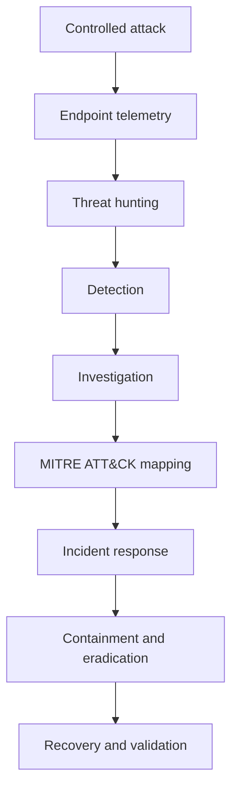
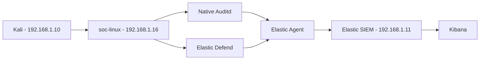
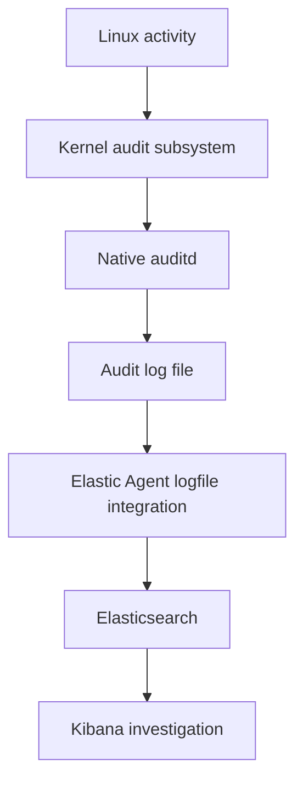
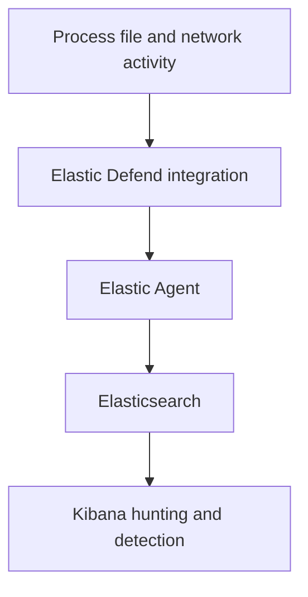
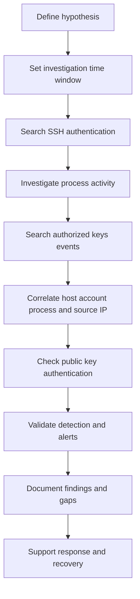
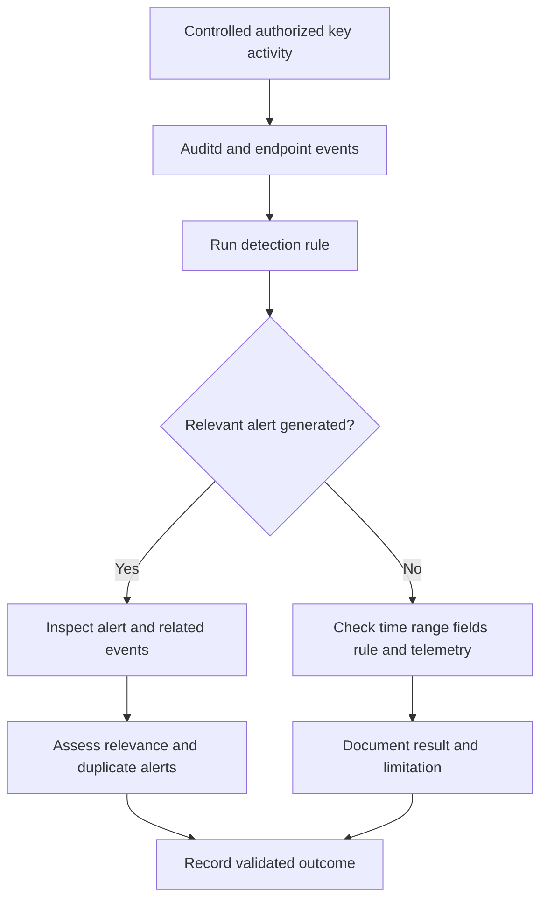
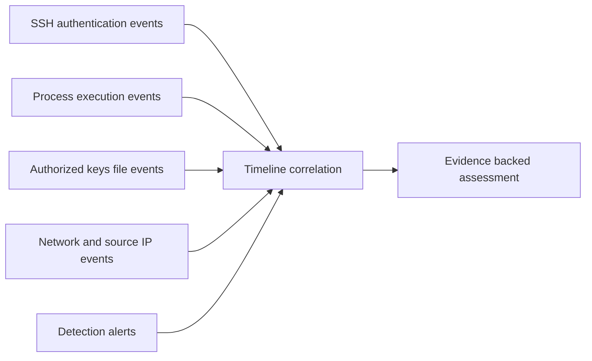
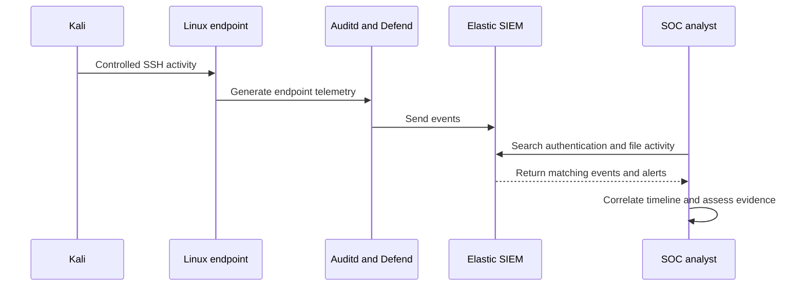
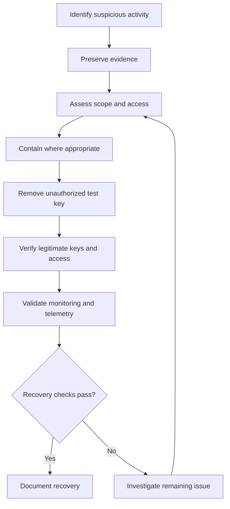
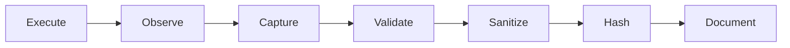

# CatchMe Linux SOC --- Project 03

# SSH Authorized-Key Backdoor Threat Hunt

## Project Overview

This project investigates unauthorized SSH public-key persistence on a
Linux endpoint and how a SOC analyst can detect, investigate, and
respond using endpoint telemetry and Elastic SIEM. The scenario focuses
on `/home/socadmin/.ssh/authorized_keys`.



The purpose is to determine whether relevant activity produces
observable telemetry, whether it can be detected and investigated, and
whether conclusions are supported by real evidence.

## Project Objectives

-   Investigate SSH authentication activity against the designated Linux
    endpoint.
-   Examine controlled post-compromise discovery activity.
-   Investigate changes to SSH authorized-key files.
-   Validate Linux Auditd and Elastic Defend telemetry.
-   Build and validate KQL queries against actual Elastic events.
-   Assess the configured Elastic Security detection.
-   Correlate authentication, process, file, user, and network evidence
    where available.
-   Map observed behavior to MITRE ATT&CK.
-   Document incident response, remediation, recovery, and validation.
-   Preserve sanitized evidence for later GitHub publication.

## Threat-Hunting Scenario

The CatchMe SOC receives an investigation lead involving suspicious SSH
access to a Linux endpoint. The analyst must determine whether an
account was accessed, whether discovery activity followed, and whether
an SSH authorized-key file was modified to enable continued access.

SSH public-key authentication is legitimate administration
functionality. An unauthorized key added to `authorized_keys`, however,
may allow future access without repeating password authentication. A
hunt limited to password authentication may miss this persistence
mechanism.

## Threat-Hunting Hypothesis

An actor who gains access to the `socadmin` account may attempt to
establish persistent SSH access by adding an unauthorized public key to
`/home/socadmin/.ssh/authorized_keys`. If observable, related file,
process, authentication, account, and network telemetry may help
establish the sequence and its context.

The hypothesis is supported only when actual evidence demonstrates a
meaningful relationship between the file modification, the responsible
account or process, and subsequent SSH authentication. Planned activity
and expected results are not findings.

## Attack Narrative

The controlled lab scenario is designed to investigate this sequence:

1.  SSH authentication is attempted from Kali to `soc-linux`.
2.  A lab session is established if authentication succeeds.
3.  Controlled post-compromise discovery activity is performed.
4.  The relevant SSH authorized-key file is identified.
5.  A controlled test public key is added to the file.
6.  File modification and related endpoint telemetry are investigated.
7.  A subsequent SSH connection is examined for public-key
    authentication.
8.  The SOC workflow proceeds through hunting, detection, investigation,
    remediation, and validation.

This is the planned scenario, not proof that each stage occurred. Mark a
stage complete only when supported by evidence. Do not repeat completed
activity solely because documentation is missing; first review existing
screenshots and available telemetry.

## Attack Objectives

-   Establish a controlled SSH investigation scenario within the
    authorized lab.
-   Observe authentication attempts and session activity.
-   Identify post-authentication discovery telemetry.
-   Investigate authorized-key file access and modification.
-   Correlate the modification with user and process context where
    available.
-   Determine whether subsequent public-key authentication occurred.
-   Evaluate telemetry and detection limitations.
-   Validate remediation and continued legitimate access.

## Scope and Safety

### In Scope

-   Authorized testing against the designated lab endpoint.
-   Controlled SSH authentication and session activity.
-   Non-destructive host discovery within the lab.
-   Controlled authorized-key modification and verification.
-   Auditd and Elastic Defend telemetry analysis.
-   Elastic KQL hunting and detection validation.
-   Evidence-backed investigation and incident response.

### Out of Scope

-   Systems outside the authorized lab.
-   Production or third-party SSH services.
-   Real customer credentials or data.
-   Destructive changes unrelated to the scenario.
-   Unauthorized access to other accounts or hosts.
-   Publishing secrets or usable authentication material.

### Evidence and Credential Safety

-   Never publish passwords, private SSH keys, tokens, cookies, or other
    secrets.
-   Sanitize screenshots and exported events before publication.
-   Use `[REDACTED]` for sensitive values.
-   Prefer public-key fingerprints or verification status over
    publishing key material.
-   Keep necessary sensitive originals in controlled local storage,
    outside Git.
-   Do not fabricate events, timestamps, screenshots, query results,
    alerts, or hashes.

## Fixed Lab Architecture

The following mapping is the established project baseline. Do not change
host assignments or IP addresses unless explicitly confirmed.

  ------------------------------------------------------------------------
  Component         Hostname          IP Address         Role
  ----------------- ----------------- ------------------ -----------------
  Kali Linux        `kiran`           `192.168.1.10`     Controlled
                                                         attacker

  Linux endpoint    `soc-linux`       `192.168.1.16`     Target and
                                                         telemetry source

  Elastic SIEM      `elastic-siem`    `192.168.1.11`     Elasticsearch,
                                                         Kibana, and Fleet

  Gateway           ---               `192.168.1.1`      Lab gateway

  Network           ---               `192.168.1.0/24`   Lab network
  ------------------------------------------------------------------------

The project time zone is `Asia/Kolkata` (IST, UTC+05:30). Preserve the
original event timestamp and time-zone context when recording the
timeline.

### Lab Architecture Diagram



### Telemetry Architecture

#### Native Auditd



#### Elastic Defend



These are complementary telemetry paths. Validate each source and its
available fields independently before correlating events.

## Expected Telemetry

  -----------------------------------------------------------------------
  Activity                Potential Source        Evidence to Examine
  ----------------------- ----------------------- -----------------------
  SSH authentication      System authentication   Account, source,
                          telemetry               method, outcome,
                                                  timestamp

  SSH session lifecycle   Authentication and      Session-related events
                          endpoint telemetry      and timing

  Process execution       Elastic Defend and      Executable, arguments,
                          Auditd                  user and process
                                                  context where available

  Authorized-key activity Auditd                  Relevant SYSCALL, PATH
                                                  and associated records

  File activity           Elastic Defend          File path and available
                                                  file metadata

  Network activity        Elastic Defend          Relevant connection
                                                  endpoints and
                                                  timestamps

  Detection               Elastic Security        Rule execution, alert,
                                                  and event correlation

  Remediation             Endpoint and            Actual changes and
                          authentication          post-remediation
                          telemetry               validation
  -----------------------------------------------------------------------

Field availability depends on the integration and event type. Inspect
representative event documents before relying on a field in a query. An
empty query result alone does not prove activity did not occur.

## Threat-Hunting Methodology

The hunt follows an evidence-first sequence.

### Threat-Hunting Flowchart



### Initial Triage

-   Which account was involved?
-   Was SSH authentication successful?
-   What source address was observed?
-   What activity followed authentication?
-   Was the authorized-key file accessed or modified?
-   Which user or process was associated with the change?
-   Was subsequent public-key authentication observed?
-   Does the timeline support a relationship between the events?

### Correlation

Correlate available fields such as:

-   `@timestamp`
-   `host.name`
-   `user.name`
-   `source.ip`
-   `process.name`
-   `process.executable`
-   `process.args`
-   `process.command_line`, when populated
-   `event.action`
-   `event.outcome`
-   `auditd.log.record_type`
-   `auditd.log.name`
-   `auditd.log.key`
-   `system.auth.ssh.method`, when available

Do not assume all fields are populated in every event. Use the fields
actually present in returned documents.

### Query Validation

For each saved KQL query, document:

1.  Purpose of the query.
2.  Data view or index pattern.
3.  Time range.
4.  Exact query.
5.  Actual result count.
6.  Relevant event fields and a representative event.
7.  Shard failures, timeouts, or other query errors.
8.  Related screenshot or evidence reference.

## Detection Strategy

The project includes an Elastic Security detection intended to identify
suspicious modification activity associated with the SSH authorized-key
file.

### Detection Objective

Identify relevant Auditd events for the designated host and
authorized-key activity while accounting for known irrelevant
audit-configuration events where appropriate.

### Existing Rule Metadata

-   Rule name: `CatchMe - Linux SSH Authorized Keys Modification`
-   Severity: High
-   Risk score: 73
-   Primary MITRE ATT&CK mapping: `T1098.004`
-   Query language: KQL
-   Primary data source: Auditd telemetry

This metadata describes the existing rule context; it does not by itself
prove the rule is currently enabled or that an activity generated an
alert.

### Detection Validation Flowchart



### Validation Requirements

-   Verify current rule configuration.
-   Confirm relevant event fields are available.
-   Validate against controlled activity and real telemetry.
-   Record alert count and details.
-   Assess syscall-level alert duplication.
-   Document false-positive considerations and justified tuning.
-   Preserve the actual rule and analysis in the detection directory.

## Investigation Strategy

The final investigation should answer:

1.  What happened and when?
2.  Which host and account were involved?
3.  What source initiated the SSH connection?
4.  Which authentication method and outcome were recorded?
5.  What post-authentication activity was observed?
6.  Was the authorized-key file modified?
7.  What evidence links the modification to the account or process?
8.  Was a subsequent public-key login observed?
9.  Which telemetry and alerts support the conclusion?
10. What was the scope and potential impact?
11. What remediation was performed?
12. How was remediation validated?

Distinguish confirmed findings from hypotheses, missing telemetry, and
inconclusive results.

### Evidence Correlation Diagram



## MITRE ATT&CK Mapping

The primary technique under investigation is:

**T1098.004 --- Account Manipulation: SSH Authorized Keys**

This technique concerns abuse of SSH authorized keys to maintain access
to an account.

Additional techniques may be included only when the corresponding
behavior is supported by observed evidence. Distinguish planned
activity, observed behavior, and behavior investigated but not
confirmed.

An SSH session alone does not prove persistence. The investigation needs
evidence of relevant key-file activity and its relationship to
subsequent access.

## Cyber Kill Chain

The Cyber Kill Chain is used as a narrative aid, not as a requirement to
claim every phase occurred.

  -----------------------------------------------------------------------
  Phase                               Project Relevance
  ----------------------------------- -----------------------------------
  Reconnaissance                      Host or account discovery, if
                                      observed

  Weaponization                       Not necessarily applicable

  Delivery                            SSH connection or authentication
                                      attempt

  Exploitation                        Successful access through the
                                      tested authentication path

  Installation                        Authorized-key persistence
                                      activity, if confirmed

  Command and Control                 Not assumed; include only if
                                      observed

  Actions on Objectives               Post-compromise activity, if
                                      observed
  -----------------------------------------------------------------------

### Investigation Sequence Diagram



This diagram describes the intended workflow, not proof that every event
was observed.

## Incident Response

### Incident Response Flowchart



### Identification

-   Validate suspicious authentication and authorized-key activity.
-   Establish a timeline from real event timestamps.
-   Correlate process, file, and authentication evidence where
    available.

### Containment

-   Choose containment actions appropriate to the lab scenario.
-   Preserve relevant evidence before changing artifacts.
-   Avoid unnecessary disruption to legitimate access or monitoring.

### Eradication

-   Remove the unauthorized test key from the designated authorized-key
    file.
-   Verify legitimate authorized keys remain intact.
-   Review relevant account and SSH access settings.

### Recovery

-   Validate legitimate SSH access.
-   Verify the unauthorized access path no longer works.
-   Confirm Auditd and Elastic Defend remain operational.
-   Review post-remediation telemetry.

### Lessons Learned

-   Document telemetry limitations.
-   Assess detection coverage and alert quality.
-   Record tuning decisions only when justified by evidence.
-   Identify improvements for subsequent CatchMe SOC projects.

## Evidence Collection Plan

Evidence must be captured during the relevant activity and validated
before documentation is finalized.

### Evidence Workflow



### Screenshot Categories

-   `09-Screenshots/Attack/` --- controlled attack activity and
    verification.
-   `09-Screenshots/Telemetry/` --- real endpoint or SIEM events.
-   `09-Screenshots/Hunting/` --- KQL queries, time range, results, and
    representative events.
-   `09-Screenshots/Detection/` --- rule configuration and actual
    alerts.
-   `09-Screenshots/Investigation/` --- event correlation and timeline.
-   `09-Screenshots/Mitre/` --- evidence-supported technique mapping.
-   `09-Screenshots/Incident-Response/` --- remediation and recovery
    validation.

Use consistent evidence identifiers, such as `P03-ATT-01`, `P03-TEL-01`,
`P03-HUNT-01`, `P03-DET-01`, `P03-INV-01`, and `P03-IR-01`. These
identifiers do not imply that an activity succeeded.

### Evidence Storage

-   `11-Evidence/Raw/` --- controlled local raw evidence, when
    necessary.
-   `11-Evidence/Sanitized/` --- publication-safe evidence.
-   `11-Evidence/Hashes/` --- SHA-256 manifests for finalized evidence.

Hash finalized evidence files and verify the hashes. Keep the hash
manifest separate from the files it describes. Do not commit secrets or
sensitive raw authentication material.

## Obsidian Diagram Compatibility

This README uses standard Markdown and Mermaid fenced code blocks, which
Obsidian supports for flowcharts, sequence diagrams, and other Mermaid
diagram types. Obsidian Canvas files, Excalidraw drawings, and embedded
local images are separate formats; they are not generated by Mermaid
blocks.

If a diagram does not render, verify the fence is exactly
```` ```mermaid ```` and the Mermaid syntax is valid for the installed
Obsidian version. Architecture diagrams can describe the planned lab;
event timelines and findings diagrams must reflect observed activity.

## Repository Structure

The established directory names and numbering are fixed. Inspect
existing files before creating or replacing content.

``` text
03-SSH-Authorized-Key-Backdoor/
├── README.md
├── 00-pre-attack/
├── 01-attack/
├── 02-telemetry/
├── 03-threat-hunting/
├── 04-detection/
│   ├── sigma/
│   │   ├── sigma-rule.yml
│   │   └── sigma-analysis.md
│   └── yara/
│       ├── yara-rule.yar
│       └── yara-analysis.md
├── 05-investigation/
├── 06-mitre/
├── 07-incident-response/
├── 08-diagrams/
├── 09-Screenshots/
│   ├── Attack/
│   ├── Telemetry/
│   ├── Hunting/
│   ├── Detection/
│   ├── Investigation/
│   ├── Mitre/
│   └── Incident-Response/
├── 10-Queries/
│   ├── KQL/
│   └── supporting-queries/
├── 11-Evidence/
│   ├── Raw/
│   ├── Sanitized/
│   └── Hashes/
└── 12-Assets/
```

## Diagram Plan

The README includes Mermaid architecture, telemetry, threat-hunting,
detection, investigation correlation, sequence, incident-response, and
evidence workflow diagrams. Supporting files may add an attack timeline,
data-flow diagram, detection-to-investigation flowchart, or recovery
workflow when these improve clarity.

Do not create a diagram that implies an event occurred when it is only
planned or hypothesized.

## Project Timeline

  -----------------------------------------------------------------------
  Phase                   Activity                Completion Requirement
  ----------------------- ----------------------- -----------------------
  0                       README and project      Scope, scenario,
                          design                  structure, and evidence
                                                  plan finalized

  1                       Environment             Fixed lab mapping and
                          verification            system health verified

  2                       Baseline validation     Relevant baseline
                                                  telemetry recorded

  3                       Attack execution        Authorized scenario
                                                  executed and observed

  4                       Telemetry validation    Relevant events located
                                                  and validated

  5                       Threat hunting          Queries executed and
                                                  findings documented

  6                       Detection validation    Rule behavior and
                                                  alerts verified

  7                       Investigation           Timeline and
                                                  conclusions supported
                                                  by evidence

  8                       MITRE mapping           Observed behavior
                                                  mapped accurately

  9                       Incident response       Remediation and
                                                  recovery validated

  10                      Evidence finalization   Evidence sanitized,
                                                  hashed, and checked

  11                      Quality review          Documentation, queries,
                                                  diagrams, and tree
                                                  verified

  12                      Publication             Repository and
                                                  publication contents
                                                  reviewed
  -----------------------------------------------------------------------

The README must be finalized before beginning the pre-attack phase.
Later documents must reflect actual activity and results rather than
expected outcomes.

## Success Criteria

-   [ ] README finalized before the pre-attack phase.
-   [ ] Fixed lab architecture verified.
-   [ ] Time zone and baseline checks documented.
-   [ ] Authorized scenario performed safely or prior activity verified.
-   [ ] SSH authentication telemetry validated.
-   [ ] Post-compromise activity investigated.
-   [ ] Authorized-key activity supported by actual evidence.
-   [ ] Subsequent authentication investigated.
-   [ ] KQL queries saved and validated against real telemetry.
-   [ ] Detection behavior and alert results documented.
-   [ ] Investigation timeline supported by evidence.
-   [ ] MITRE ATT&CK mapping justified.
-   [ ] Incident response and remediation documented.
-   [ ] Recovery and post-remediation validation completed.
-   [ ] Screenshots reviewed and sanitized.
-   [ ] Evidence files organized and hashes verified.
-   [ ] Diagrams match verified findings.
-   [ ] No credentials or sensitive authentication material exposed.
-   [ ] Repository structure and filenames verified.
-   [ ] Git history and publication contents reviewed.
-   [ ] Remaining limitations explicitly documented.

A criterion must not be marked complete until its requirement has been
verified.

## Current Project Status

This README defines the project scenario, scope, fixed lab architecture,
planned investigation, diagrams, and evidence requirements. It is not
proof that every stage has been executed or passed.

Existing screenshots and historical investigation notes must be reviewed
against their actual contents and available telemetry before findings
are accepted into the final report.

  -----------------------------------------------------------------------
  Item                                Status
  ----------------------------------- -----------------------------------
  Project design                      Documented in this README

  Environment verification            To be verified before pre-attack
                                      activities

  Existing attack screenshots         Present; contents require review

  Telemetry findings                  Require correlation with actual
                                      events

  KQL library                         Saved files and validation required

  Detection                           Current configuration and results
                                      require verification

  Investigation                       Final evidence-backed documentation
                                      pending

  Incident response                   Remediation and recovery evidence
                                      pending verification

  Evidence hashes                     Pending finalized evidence

  Git publication                     Pending repository verification
  -----------------------------------------------------------------------

## Project Principle

**No fabricated results. No unsupported conclusions. No unnecessary
changes to validated infrastructure.**

Every final finding must be traceable to real lab activity, actual
telemetry, or explicitly identified historical evidence. Missing
evidence must be recovered or documented as a limitation; it must never
be invented.
