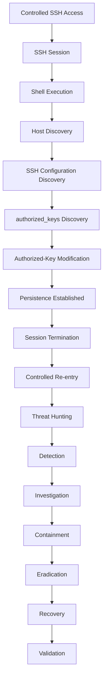

# CatchMe Linux SOC — Project 03
# SSH Authorized-Key Backdoor Threat Hunt

## Project Overview

Project 03 is a controlled Linux SOC threat-hunting investigation focused on detecting and investigating SSH-based persistence through modification of a user's `authorized_keys` file.

The scenario begins with controlled SSH access to the Linux endpoint and progresses through post-compromise discovery, SSH configuration discovery, `authorized_keys` discovery, persistence establishment, session termination, and controlled re-entry using the persistence mechanism.

The investigation is designed as an end-to-end SOC workflow rather than an isolated technique demonstration.

---

## Project Objective

Demonstrate a complete Linux threat-hunting workflow covering:

- Initial triage
- SSH authentication analysis
- User and host activity analysis
- Process and shell activity
- SSH configuration discovery
- `authorized_keys` discovery
- Persistence detection
- File modification investigation
- Source IP and account correlation
- KQL threat hunting
- Elastic detection engineering
- Sigma detection engineering
- YARA applicability assessment
- MITRE ATT&CK mapping
- Cyber Kill Chain mapping
- Incident investigation
- Containment
- Eradication
- Recovery
- Validation
- Evidence preservation

---

## Lab Environment

| Component | Hostname | IP Address | Role |
|---|---|---|---|
| Elastic SIEM | `elastic-siem` | `192.168.1.11` | Elasticsearch, Kibana, Fleet |
| Linux Endpoint | `soc-linux` | `192.168.1.16` | Ubuntu Linux target |
| Kali Attacker | `kiran` | `192.168.1.10` | Controlled attack simulation |

### Network

- Network: `192.168.1.0/24`
- Gateway: `192.168.1.1`
- Project timezone: `Asia/Kolkata / IST`

---

## Scope

### In Scope

- SSH authentication
- Valid-account access
- Linux shell activity
- Host discovery
- SSH configuration discovery
- SSH key locations
- `authorized_keys` inspection
- Controlled authorized-key modification
- Persistence validation
- Subsequent SSH authentication
- Endpoint telemetry
- Threat hunting
- Detection
- Investigation
- Incident response

### Out of Scope

Unless explicitly observed and documented during execution:

- Privilege escalation
- Kernel exploitation
- Credential dumping
- Data exfiltration
- Destructive activity
- Malware deployment
- Rootkit installation
- C2 infrastructure
- Lateral movement to production systems

The investigation will not claim activity that was not actually performed or observed.

---

# Threat Scenario

## Scenario Name

**SSH Authorized-Key Backdoor**

## Scenario Summary

An attacker obtains controlled access to a Linux account through SSH and performs post-compromise discovery.

The attacker identifies SSH configuration and the user's `authorized_keys` location, modifies the authorized-key file to establish persistence, terminates the current session, and subsequently attempts controlled re-entry using the persistence mechanism.

The SOC must identify the suspicious sequence through endpoint and authentication telemetry and determine:

1. Who accessed the system?
2. From where?
3. Which account was used?
4. What processes and commands were executed?
5. Was SSH configuration inspected?
6. Was `authorized_keys` accessed?
7. Was the file modified?
8. Which process performed the modification?
9. When did persistence occur?
10. Was the persistence mechanism subsequently used?
11. What evidence confirms the attack chain?
12. How should the persistence mechanism be contained and removed?

---

# Threat-Hunting Hypothesis

## Primary Hypothesis

> A valid SSH session to `soc-linux` may be followed by suspicious discovery of SSH configuration and modification of the user's `authorized_keys` file, resulting in persistence and subsequent SSH re-entry.

## Supporting Hypotheses

### Hypothesis 1 — SSH Access

A valid SSH session may originate from an unexpected or suspicious source and establish an interactive shell.

### Hypothesis 2 — Post-Compromise Discovery

The authenticated user may perform host, account, SSH, or file-system discovery shortly after login.

### Hypothesis 3 — Persistence

The authenticated session may access and modify `authorized_keys`.

### Hypothesis 4 — Persistence Reuse

A subsequent SSH authentication may originate from the same source and account after the key modification.

### Hypothesis 5 — Process Correlation

The file modification may be correlated with a shell or process responsible for the persistence action.

---

# Initial Triage Model

The investigation will begin with five primary dimensions.

## 1. Identity Pattern

Investigate:

- Username
- Authentication method
- Source IP
- Source port
- SSH session
- First seen activity
- Subsequent authentication

## 2. Behavior Pattern

Investigate:

- Shell creation
- Host discovery
- Account discovery
- SSH configuration inspection
- File discovery
- `authorized_keys` access
- File modification
- Persistence activity

## 3. Reputation Pattern

Investigate:

- Source IP context
- Whether the source is expected within the lab
- Whether the source is associated with known test infrastructure
- Whether the account/source relationship is expected

Because this is a controlled lab, reputation analysis will be documented in the context of the lab rather than treated as an Internet reputation investigation.

## 4. Traffic Pattern

Investigate:

- SSH connection
- Source/destination relationship
- Connection timing
- Repeated SSH sessions
- Source port changes
- Subsequent SSH re-entry

## 5. Timeline Pattern

Correlate:

```text
SSH Authentication
        ↓
Session Creation
        ↓
Shell Activity
        ↓
Discovery
        ↓
authorized_keys Access
        ↓
File Modification
        ↓
Session Termination
        ↓
Subsequent SSH Authentication
```

Actual timestamps will be populated only after execution.

---

# Expected Attack Chain



---

# Expected Telemetry

## Authentication Telemetry

Expected sources may include:

* SSH authentication logs
* system authentication logs
* system journal
* Elastic `system.auth` events
* SSH login events
* authentication success/failure events

Potential fields:

* `@timestamp`
* `host.name`
* `user.name`
* `source.ip`
* `source.port`
* `process.name`
* `event.action`
* `event.category`
* authentication message

---

## Process Telemetry

Expected information:

* SSH daemon
* shell process
* command execution
* parent/child process relationships
* process user
* process arguments

---

## File Telemetry

Expected information:

* `authorized_keys` access/modification
* file path
* file metadata
* file modification timestamp
* process responsible for modification
* user associated with the activity

The exact telemetry available will be verified before and during execution.

---

## Network Telemetry

Expected information:

* SSH source IP
* destination IP
* source port
* destination port
* connection timing
* repeated sessions

---

# Threat-Hunting Methodology

The investigation will use a pivot-based methodology.

```text
Source IP
    ↓
User
    ↓
SSH Authentication
    ↓
Session
    ↓
Process
    ↓
Command / Shell
    ↓
File
    ↓
authorized_keys
    ↓
Persistence
    ↓
Subsequent Authentication
```

Every KQL query must answer a specific SOC question.

Queries will not be created merely to increase the query count.

---

# KQL Investigation Strategy

Potential hunting areas include:

1. SSH authentication
2. Successful authentication
3. Failed authentication
4. Source IP correlation
5. User correlation
6. SSH session creation
7. SSH session termination
8. Shell/process activity
9. Host discovery
10. Account discovery
11. SSH configuration discovery
12. `authorized_keys` access
13. File modification
14. Process-to-file correlation
15. Timeline correlation
16. Subsequent SSH activity
17. Persistence validation
18. Related endpoint activity

Actual queries will be created during the hunt based on the telemetry observed.

---

# Detection Strategy

## Elastic Detection

The final Elastic detection will be based on actual telemetry observed during the investigation.

Potential detection logic may correlate:

```text
SSH Activity
+
Suspicious authorized_keys Modification
+
User / Source Correlation
=
Potential SSH Persistence
```

The exact detection rule will be finalized after telemetry validation.

---

# Sigma Strategy

Sigma will be used for portable behavioral/log detection.

Potential detection areas:

* suspicious SSH authentication
* suspicious modification of `authorized_keys`
* SSH persistence behavior
* process/file correlation

The final Sigma rule will be based on actual observed fields and event structure.

File:

`04-detection/sigma/sigma-rule.yml`

Supporting documentation:

`04-detection/sigma/sigma-analysis.md`

---

# YARA Strategy

YARA will be evaluated for applicability rather than being forced into the project.

YARA is appropriate when the investigation produces a suitable file or content artifact such as:

* malicious payload
* suspicious script
* ELF malware
* backdoor binary
* dropped file
* malicious configuration artifact

The Project 03 scenario primarily concerns SSH persistence behavior and file modification.

If no suitable malware/content artifact is produced, the YARA analysis will document:

> YARA not applicable to the observed Project 03 artifact set.

No artificial YARA rule will be created merely for portfolio completeness.

Files:

* `04-detection/yara/yara-rule.yar`
* `04-detection/yara/yara-analysis.md`

---

# Investigation Objectives

The investigation must establish:

### Identity

* Account used
* Source IP
* Authentication method
* Authentication timeline

### Process

* SSH daemon
* Shell
* Relevant processes
* Parent/child relationships

### File

* `authorized_keys`
* File ownership
* Permissions
* Modification
* Modification timestamp
* Responsible process

### Persistence

* Persistence mechanism
* Key placement
* Key usage
* Subsequent authentication

### Scope

* Affected host
* Affected account
* Source system
* Related sessions

### Impact

Determine the actual impact supported by evidence.

---

# MITRE ATT&CK Strategy

MITRE mappings will distinguish between:

* Planned
* Observed
* Not observed
* Not applicable

Each technique will document:

| Field                  | Requirement                   |
| ---------------------- | ----------------------------- |
| Tactic                 | ATT&CK tactic                 |
| Technique ID           | Exact ID                      |
| Technique              | Official technique name       |
| Sub-technique          | Where applicable              |
| Attack Stage           | Where it occurred             |
| Attacker Activity      | Actual activity               |
| Expected Telemetry     | Relevant telemetry            |
| Hunting Evidence       | Supporting evidence           |
| Detection Opportunity  | Detection logic               |
| Investigation Evidence | Investigation proof           |
| Response               | Mitigation/response           |
| Confidence             | Confidence level              |
| Evidence Reference     | Screenshot/evidence reference |

Exact technique mappings will be validated against the current ATT&CK version during the MITRE phase.

---

# Cyber Kill Chain

The investigation will map observed activity to the Cyber Kill Chain where applicable.

Potential stages:

```text
Reconnaissance
      ↓
Weaponization
      ↓
Delivery
      ↓
Exploitation
      ↓
Installation
      ↓
Command & Control
      ↓
Actions on Objectives
```

Only applicable/observed stages will be documented.

---

# Incident Response Strategy

## Triage

Identify:

* affected host
* affected account
* source
* persistence artifact
* active sessions
* attack timeline

## Containment

Potential actions:

* terminate malicious sessions
* restrict source access
* disable compromised access
* preserve evidence

## Eradication

Potential actions:

* remove unauthorized SSH key
* validate `authorized_keys`
* inspect SSH configuration
* remove persistence artifacts

## Recovery

Potential actions:

* restore approved SSH configuration
* validate authorized access
* verify endpoint telemetry
* monitor for re-entry

## Validation

Confirm:

* unauthorized key removed
* persistence no longer works
* legitimate SSH access remains functional
* monitoring remains operational
* no additional persistence was identified

Actual remediation actions will be documented after execution.

---

# Evidence Strategy

Evidence will be collected throughout the investigation.

## Raw Evidence

`11-Evidence/Raw/`

Contains original evidence and factual outputs.

## Sanitized Evidence

`11-Evidence/Sanitized/`

Contains sanitized portfolio-ready evidence where required.

## Hashes

`11-Evidence/Hashes/`

Contains SHA-256 hashes of finalized evidence.

The hash manifest itself will not be included in its own hash calculation.

---

# Screenshot Strategy

Screenshots will be captured during actual activity.

## Attack

* SSH access
* persistence action
* controlled re-entry

## Telemetry

* authentication events
* process events
* file events
* network events

## Hunting

* KQL queries
* investigation results
* timeline correlation

## Detection

* detection rule
* Sigma
* Elastic alert

## Investigation

* event details
* process correlation
* file investigation
* persistence evidence

## MITRE

* technique evidence

## Incident Response

* containment
* eradication
* remediation
* validation

No duplicate screenshots will be retained unless they demonstrate materially different evidence.

---

# Diagram Plan

Potential diagrams include:

1. Lab Architecture
2. Attack Chain
3. Telemetry Pipeline
4. Threat Hunting Flow
5. Initial Triage Flow
6. Query Investigation Chain
7. Detection Workflow
8. Persistence Flow
9. File Investigation Flow
10. Account Investigation Flow
11. Network Investigation Flow
12. MITRE ATT&CK Mapping
13. Cyber Kill Chain
14. Incident Response Flow
15. Containment / Remediation
16. Evidence Correlation
17. Detection Improvement
18. Final Attack Timeline
19. End-to-End SOC Workflow
20. Investigation Summary

Diagrams will only be finalized when supported by the actual project workflow and evidence.

---

# Project Control Matrix

| Control                  | Planned | Executed | Evidence | Screenshot | Documentation | Verified |
| ------------------------ | ------- | -------- | -------- | ---------- | ------------- | -------- |
| Environment Verification | Yes     | Pending  | Pending  | Pending    | Planned       | Pending  |
| Baseline                 | Yes     | Pending  | Pending  | Pending    | Planned       | Pending  |
| Hunt Hypothesis          | Yes     | Pending  | N/A      | N/A        | Planned       | Pending  |
| Attack Execution         | Yes     | Pending  | Pending  | Pending    | Planned       | Pending  |
| Telemetry                | Yes     | Pending  | Pending  | Pending    | Planned       | Pending  |
| Initial Triage           | Yes     | Pending  | Pending  | Pending    | Planned       | Pending  |
| Threat Hunting           | Yes     | Pending  | Pending  | Pending    | Planned       | Pending  |
| KQL                      | Yes     | Pending  | Pending  | Pending    | Planned       | Pending  |
| Elastic Detection        | Yes     | Pending  | Pending  | Pending    | Planned       | Pending  |
| Sigma                    | Yes     | Pending  | Pending  | Pending    | Planned       | Pending  |
| YARA Assessment          | Yes     | Pending  | Pending  | Pending    | Planned       | Pending  |
| Investigation            | Yes     | Pending  | Pending  | Pending    | Planned       | Pending  |
| MITRE ATT&CK             | Yes     | Pending  | Pending  | Planned    | Planned       | Pending  |
| Cyber Kill Chain         | Yes     | Pending  | Pending  | Planned    | Planned       | Pending  |
| Containment              | Yes     | Pending  | Pending  | Pending    | Planned       | Pending  |
| Eradication              | Yes     | Pending  | Pending  | Pending    | Planned       | Pending  |
| Recovery                 | Yes     | Pending  | Pending  | Pending    | Planned       | Pending  |
| Validation               | Yes     | Pending  | Pending  | Pending    | Planned       | Pending  |
| Incident Report          | Yes     | Pending  | Pending  | Pending    | Planned       | Pending  |
| Playbook / Runbook       | Yes     | Pending  | Pending  | Planned    | Planned       | Pending  |
| Screenshots              | Yes     | Pending  | Pending  | N/A        | Planned       | Pending  |
| Raw Evidence             | Yes     | Pending  | Pending  | N/A        | Planned       | Pending  |
| Sanitized Evidence       | Yes     | Pending  | Pending  | N/A        | Planned       | Pending  |
| SHA-256                  | Yes     | Pending  | Pending  | N/A        | Planned       | Pending  |
| Mermaid / Diagrams       | Yes     | Pending  | Pending  | N/A        | Planned       | Pending  |
| Final Cheat Sheet        | Yes     | Pending  | Pending  | N/A        | Planned       | Pending  |
| Git Verification         | Yes     | Pending  | Pending  | N/A        | Planned       | Pending  |

---

# Safety and Lab Controls

This project is restricted to the controlled CatchMe Linux SOC lab.

Attack activity must remain limited to:

* `192.168.1.10` — Kali
* `192.168.1.16` — `soc-linux`
* `192.168.1.11` — `elastic-siem`

No production systems or third-party systems are included.

Destructive actions are excluded.

Evidence must be captured before modifying or removing persistence artifacts during remediation.

---

# Project Success Criteria

Project 03 is complete only when the following are demonstrated with evidence:

* [ ] Environment verified
* [ ] Baseline captured
* [ ] Hunt hypothesis documented
* [ ] Attack executed
* [ ] SSH activity captured
* [ ] Post-compromise activity captured
* [ ] `authorized_keys` activity investigated
* [ ] Persistence established in the controlled lab
* [ ] Persistence re-entry validated
* [ ] Threat hunt completed
* [ ] KQL investigation chain documented
* [ ] Elastic detection validated
* [ ] Sigma evaluated/validated
* [ ] YARA applicability evaluated
* [ ] Investigation completed
* [ ] MITRE mapping completed
* [ ] Cyber Kill Chain completed
* [ ] Containment completed
* [ ] Eradication completed
* [ ] Recovery completed
* [ ] Validation completed
* [ ] Incident report completed
* [ ] Playbooks/runbooks completed
* [ ] Screenshots captured
* [ ] Raw evidence preserved
* [ ] Sanitized evidence prepared
* [ ] SHA-256 hashes generated
* [ ] Diagrams finalized
* [ ] Control matrix completed
* [ ] Final Git verification completed

---

# Current Project Status

**Project:** 03 — SSH Authorized-Key Backdoor

**Phase:** Stage 0 — Blueprint

**Status:** Pre-attack design

**Attack Executed:** No

**Telemetry Collected:** No Project 03 attack telemetry

**Detection Validated:** No

**Investigation Completed:** No

**Incident Response Completed:** No

**Evidence Finalized:** No

**GitHub Publication:** Pending

---


