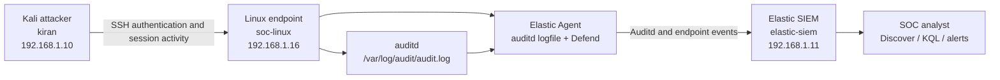
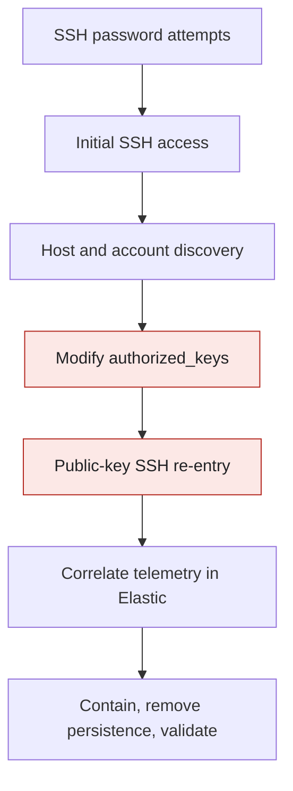
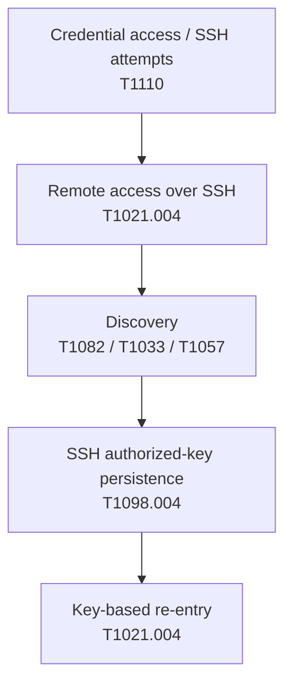
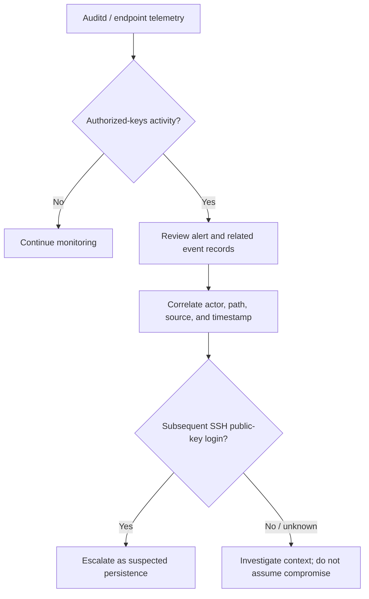
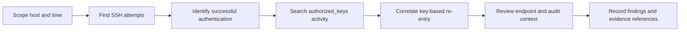
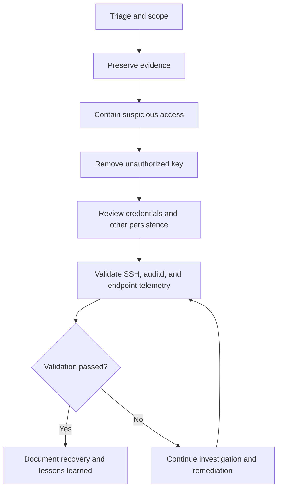

# Project 03 --- SSH Authorized-Key Backdoor Threat Hunt

> **CatchMe \| Linux Security Operations Center (SOC) Portfolio**
>
> A lab-based investigation of SSH password-based initial access, host
> discovery, SSH public-key persistence, and subsequent key-based
> re-entry, using Linux audit telemetry and Elastic SIEM.


 

------------------------------------------------------------------------

## 1. Project Overview

This project examines how an attacker with access to a Linux account
could establish SSH persistence by adding a public key to that account's
`authorized_keys` file, then use the key to authenticate again. The
investigation focuses on correlating SSH authentication, file and audit
activity, endpoint telemetry, and subsequent session activity.

The lab is designed to demonstrate a complete SOC workflow: define a
hypothesis, generate controlled activity in an authorized lab, validate
telemetry, hunt for related events, assess detection coverage,
investigate the sequence, and document response and recovery.

### Objectives

1.  Investigate SSH authentication activity from the designated Kali
    attacker.
2.  Correlate initial access with post-login discovery activity.
3.  identify and investigate changes to an SSH `authorized_keys` file.
4.  Correlate a successful public-key login with earlier persistence
    activity.
5.  Validate relevant auditd and Elastic Defend telemetry in Elastic.
6.  Document detection logic, investigation queries, evidence, and
    response considerations without exposing passwords or private key
    material.

### Scope and authorization

All activity described here belongs to a controlled, privately managed
lab. The scenario is intended for defensive validation and SOC portfolio
demonstration, not for use against systems without explicit
authorization. Credentials and SSH key material must be redacted from
screenshots, notes, and published artifacts.

------------------------------------------------------------------------

## 2. Lab Architecture

### Fixed host mapping

  Role                    Hostname                     IPv4 address
  ----------------------- ---------------------- ------------------
  Attacker workstation    `kiran` (Kali Linux)       `192.168.1.10`
  Linux target endpoint   `soc-linux`                `192.168.1.16`
  Elastic SIEM            `elastic-siem`             `192.168.1.11`
  Default gateway         ---                         `192.168.1.1`
  Lab subnet              ---                      `192.168.1.0/24`

**Addressing constraint:** use `192.168.1.10` as the Kali lab address.
Do not substitute the Kali Wi-Fi address `192.168.1.9` in the attack
narrative or correlation queries.

### Data-flow diagram



### Telemetry sources

  -----------------------------------------------------------------------
  Source                              Purpose
  ----------------------------------- -----------------------------------
  Linux OpenSSH / authentication      Authentication outcomes, source
  events                              address, method, and session
                                      lifecycle where fields are
                                      available

  Linux auditd                        Audited system calls and file-path
                                      activity relevant to persistence
                                      and execution

  Elastic Defend                      Endpoint process, file, and network
                                      event context

  Elastic SIEM / Discover             Event correlation, KQL hunting, and
                                      detection alert review
  -----------------------------------------------------------------------

The presence of a field depends on the event source and integration. Do
not assume that every event contains the same normalized fields. In
particular, use the actual fields present in the event; command-level
audit events may be more complete in `process.args` than in normalized
`process.command_line`.

------------------------------------------------------------------------

## 3. Attack Narrative

The intended sequence is:

1.  **Initial access attempt:** SSH password authentication attempts
    against `soc-linux` from the Kali lab host.
2.  **Successful access:** a valid account is used to establish an SSH
    session.
3.  **Post-compromise discovery:** basic host, user, process, network,
    and session information is examined.
4.  **Persistence:** a public key is added to the target account's SSH
    `authorized_keys` file.
5.  **Re-entry:** a later SSH session authenticates using the public
    key.
6.  **SOC investigation:** correlate the authentication timeline, file
    change, and later session, then evaluate containment and recovery.

### Attack-chain diagram



### Evidence-based reporting rule

A scenario step is not automatically a confirmed finding. Distinguish
between:

-   **Observed:** directly supported by a reviewed screenshot or event.
-   **Reported historically:** recorded in previous lab notes but not
    yet independently re-verified from raw event exports in this
    repository.
-   **Expected:** telemetry or behavior that the hunt hypothesis
    predicts.
-   **Not yet verified:** evidence or validation still required.

This README intentionally does not publish a password, private key, or
full public-key line.

------------------------------------------------------------------------

## 4. MITRE ATT&CK Mapping

  --------------------------------------------------------------------------------------------------------
  Technique                                                Relevance to this       Evidence needed
                                                           scenario                
  -------------------------------------------------------- ----------------------- -----------------------
  [T1110 --- Brute                                         Multiple SSH            Authentication failure
  Force](https://attack.mitre.org/techniques/T1110/)       authentication attempts events correlated by
                                                                                   source, target, and
                                                                                   time

  [T1021.004 ---                                           Remote access using SSH SSH authentication and
  SSH](https://attack.mitre.org/techniques/T1021/004/)                             session telemetry

  [T1082 --- System Information                            Host and OS discovery   Process/audit events or
  Discovery](https://attack.mitre.org/techniques/T1082/)   after access            session evidence

  [T1033 --- System Owner/User                             Account and             Relevant command or
  Discovery](https://attack.mitre.org/techniques/T1033/)   user-context discovery  audit telemetry

  [T1057 --- Process                                       Process enumeration     Endpoint process events
  Discovery](https://attack.mitre.org/techniques/T1057/)                           or audit records

  [T1098.004 --- SSH Authorized                            Add or modify an SSH    Audited file activity
  Keys](https://attack.mitre.org/techniques/T1098/004/)    authorized key for      and/or endpoint file
                                                           persistence             events, plus key-based
                                                                                   re-entry correlation
  --------------------------------------------------------------------------------------------------------

Technique mapping is a hypothesis until supported by evidence. Only
claim a technique as observed when the corresponding activity is visible
in reviewed evidence.



------------------------------------------------------------------------

## 5. Detection Strategy

### Primary detection objective

Identify a modification to the authorized-keys file for a monitored
Linux account and investigate whether the modification is followed by
SSH public-key authentication from an unexpected source.

### Existing lab detection rule

The following KQL is the rule definition recorded for the lab's
authorized-keys detection. Verify the current rule configuration and
alert evidence before describing a specific alert as a successful
end-to-end validation.

``` kql
host.name:"soc-linux" AND
data_stream.dataset:"auditd.log" AND
auditd.log.key:"ssh_authorized_keys" AND
auditd.log.record_type:"SYSCALL" AND
NOT event.action:"changed-audit-configuration"
```

  Setting          Recorded configuration
  ---------------- ----------------------------------------------------
  Rule name        `CatchMe - Linux SSH Authorized Keys Modification`
  Severity         High
  Risk score       73
  ATT&CK mapping   T1098.004 --- SSH Authorized Keys
  Query type       KQL

Audit syscall events can generate multiple records for one file
operation. The lab previously produced multiple high-severity alerts
from one controlled file operation. Alert volume therefore needs
event-level review and deduplication assessment; it must not be
interpreted as an equal number of separate incidents.

### Detection logic diagram



------------------------------------------------------------------------

## 6. Threat-Hunting Queries

Run these queries in the intended Kibana data view and time range. Field
availability can vary by event source; broaden the query or inspect raw
event JSON if a field-specific query returns no results. A zero-result
query alone does not prove that the activity did not occur.

### SSH activity from the Kali lab host

``` kql
host.name:"soc-linux" AND
process.name:"sshd" AND
source.ip:"192.168.1.10"
```

### SSH authentication failures and logins from Kali

``` kql
host.name:"soc-linux" AND
process.name:"sshd" AND
source.ip:"192.168.1.10" AND
(event.action:"authentication_failure" OR event.action:"ssh_login")
```

### Public-key authentication success

``` kql
host.name:"soc-linux" AND
process.name:"sshd" AND
source.ip:"192.168.1.10" AND
system.auth.ssh.method:"publickey" AND
event.outcome:"success"
```

### Authorized-keys file activity in auditd

``` kql
host.name:"soc-linux" AND
data_stream.dataset:"auditd.log" AND
auditd.log.record_type:"PATH" AND
auditd.log.name:"/home/socadmin/.ssh/authorized_keys"
```

### Legacy broad search for authorized-keys references

``` kql
host.name:"soc-linux" AND
(file.path:"/home/socadmin/.ssh/authorized_keys" OR message:"*authorized_keys*")
```

Prefer structured auditd fields when they are present. The broad query
is a fallback, not a substitute for reviewing the raw event.

### Auditd activity in the historical lab window

The following is a historical investigation window recorded in IST for
the October 3, 2026 exercise. Use it only when querying that historical
data.

``` kql
host.name:"soc-linux" AND
(event.module:"auditd" OR data_stream.dataset:"auditd.*") AND
@timestamp >= "2026-10-03T14:35:00+05:30" AND
@timestamp <= "2026-10-03T14:47:00+05:30"
```

### SSH session lifecycle

``` kql
host.name:"soc-linux" AND
user.name:"socadmin" AND
source.ip:"192.168.1.10" AND
process.executable:"/usr/sbin/sshd" AND
event.action:("authenticated" OR "was-authorized" OR "acquired-credentials" OR "started-session" OR "ended-session")
```

### Endpoint process events

``` kql
host.name:"soc-linux" AND
data_stream.dataset:"endpoint.events.process"
```

### Endpoint file events

``` kql
host.name:"soc-linux" AND
data_stream.dataset:"endpoint.events.file"
```

### Endpoint network events

``` kql
host.name:"soc-linux" AND
data_stream.dataset:"endpoint.events.network"
```

### Sudo activity

``` kql
host.name:"soc-linux" AND
process.name:"sudo" AND
event.action:(ran-command OR was-authorized OR started-session OR ended-session OR authenticated OR authentication_failure)
```

### Query workflow



------------------------------------------------------------------------

## 7. Evidence Inventory

The project folder contains screenshots organized under
`09-Screenshots/Attack`, `09-Screenshots/Telemetry`, and
`09-Screenshots/Hunting`. Filenames indicate the intended evidence
topic; the filename alone is not proof of the content or conclusion.

### Attack screenshots

  ----------------------------------------------------------------------------------
  File                                           Intended evidence topic
  ---------------------------------------------- -----------------------------------
  `P03-ATT-01-credential-discovery.png`          Credential-testing phase

  `P03-ATT-02-ssh-initial-access.png`            SSH initial access

  `P03-ATT-03-post-compromise-discovery.png`     Post-access discovery

  `P03-ATT-04-authorized-key-persistence.png`    Authorized-key persistence

  `P03-ATT-05-authorized-key-verification.png`   Key-file verification

  `P03-ATT-06-key-based-reentry.png`             SSH re-entry using a key
  ----------------------------------------------------------------------------------

### Telemetry screenshots

  ---------------------------------------------------------------------------------
  File                                          Intended evidence topic
  --------------------------------------------- -----------------------------------
  `P03-TEL-01-ssh-password-attack.png`          SSH password-attempt telemetry

  `P03-TEL-02-ssh-initial-access.png`           Initial-access telemetry

  `P03-TEL-03-post-compromise-discovery.png`    Discovery telemetry

  `P03-TEL-04-authorized-key-persistence.png`   Authorized-key telemetry

  `P03-TEL-05-key-based-reentry.png`            Public-key re-entry telemetry
  ---------------------------------------------------------------------------------

### Threat-hunting screenshots

The `09-Screenshots/Hunting/` directory contains evidence images
covering the SSH timeline, authentication correlation and methods,
public-key re-entry, authorized-keys activity, auditd persistence
telemetry, SSH session lifecycle, and sudo activity.

Before publication, inspect each image for secrets, personal
information, unredacted credentials, key material, and unrelated host
details. Link screenshots in the final report only after checking that
the image supports the adjacent claim. Keep raw event exports and other
sensitive evidence out of the public repository unless specifically
sanitized and approved.

------------------------------------------------------------------------

## 8. Historical Lab Notes --- Require Evidence Reconciliation

The following details were recorded in earlier project notes. They are
included as **historical leads**, not as independently re-verified
findings from raw event exports in this repository.

-   The SSH exercise was recorded on October 3, 2026.
-   The reported lab source and destination were `192.168.1.10` and
    `192.168.1.16`, respectively.
-   Earlier notes describe password-based SSH access, post-access
    discovery, a change to `/home/socadmin/.ssh/authorized_keys`, and
    later public-key re-entry.
-   The recorded re-entry time was `2026-10-03 14:45:53.827 IST`, with
    user `socadmin`, source `192.168.1.10`, and authentication method
    `publickey`.
-   Earlier notes reported an `authorized_keys` entry count change from
    one to two and file modification time `2026-10-03 14:40:56 IST`.

These details must be reconciled against the corresponding screenshots
and, where available, the actual Elasticsearch events before they are
elevated to confirmed findings. Never publish the password, private key,
or full public-key material. If the raw data is unavailable, retain the
historical qualifier.

------------------------------------------------------------------------

## 9. Incident Response Plan

### Triage

1.  Confirm the affected endpoint, account, file path, and event time.
2.  Inspect the raw auditd or endpoint event and identify the actor,
    operation, and relevant file metadata.
3.  Correlate SSH authentication events by source IP, account,
    authentication method, and session lifecycle.
4.  Review adjacent process, sudo, and discovery activity.
5.  Preserve evidence and record time-zone assumptions.

### Containment

-   Follow the lab's approved response procedure before disabling
    accounts or terminating sessions.
-   Restrict suspicious SSH access where appropriate and preserve
    relevant logs.
-   If the account or key is confirmed unauthorized, revoke the affected
    key and assess whether the account credentials must also be rotated.
-   Do not remove evidence before preserving the relevant event records
    and file metadata.

### Eradication and recovery

-   Remove only the unauthorized `authorized_keys` entry after
    preserving evidence and confirming the correct authorized entries.
-   Review SSH configuration and account access for other persistence
    paths.
-   Rotate exposed credentials when warranted.
-   Verify file ownership and permissions, including the `.ssh`
    directory and `authorized_keys` file.
-   Confirm legitimate SSH access still works and that new unauthorized
    modifications are not occurring.

### Validation

-   Re-query the relevant time range and confirm the persistence
    artifact is absent.
-   Confirm expected auditd and endpoint telemetry continues to arrive.
-   Perform only approved, controlled validation actions.
-   Record results and evidence references. Do not claim successful
    eradication or recovery until verified.



------------------------------------------------------------------------

## 10. Project Status and Publication Gate

This README describes the investigation design, relevant lab mapping,
known query patterns, and the evidence inventory. It does not, by
itself, prove that every project phase is complete.

  -----------------------------------------------------------------------
  Workstream                          Publication status
  ----------------------------------- -----------------------------------
  README and project structure        Documented; review against local
                                      project before publication

  Pre-attack environment and baseline Must be supported by the
                                      corresponding project documents

  Attack execution                    Screenshots exist; reconcile their
                                      contents and any available original
                                      notes

  Telemetry                           Screenshots exist; correlate with
                                      actual events where available

  Threat hunting                      Hunting screenshots exist; query
                                      results and findings need evidence
                                      references

  Detection                           Rule definition is recorded; verify
                                      current rule and alert evidence

  Investigation                       Complete only when findings and
                                      timeline are tied to evidence

  Incident response                   Runbooks are plans until
                                      containment, eradication, recovery,
                                      and validation are demonstrated

  Evidence hashes                     Do not claim complete until hashes
                                      are generated and verified

  Git / GitHub publication            Paused; no repository
                                      initialization or push implied by
                                      this README
  -----------------------------------------------------------------------

### Publication checklist

-   [ ] Review every screenshot and redact sensitive material.
-   [ ] Reconcile historical timestamps and claims with the available
    evidence.
-   [ ] Remove any secrets, credentials, private keys, tokens, and
    sensitive raw telemetry.
-   [ ] Ensure all referenced files exist at the paths used in the
    documentation.
-   [ ] Run and record the final KQL validation against the intended
    data view and time range.
-   [ ] Generate hashes for the evidence files selected for publication.
-   [ ] Check Markdown links and Mermaid rendering in the intended
    GitHub repository.
-   [ ] Confirm the project status table reflects verified results
    rather than planned work.

------------------------------------------------------------------------

## 11. Repository Layout

``` text
03-SSH-Authorized-Key-Backdoor/
├── README.md
├── 00-pre-attack/
├── 01-attack/
├── 02-telemetry/
├── 03-threat-hunting/
├── 04-detection/
│   ├── sigma/
│   └── yara/
├── 05-investigation/
├── 06-mitre/
├── 07-incident-response/
├── 08-diagrams/
├── 09-Screenshots/
│   ├── Attack/
│   ├── Telemetry/
│   ├── Hunting/
│   ├── Detection/
│   ├── Investigation/
│   ├── Mitre/
│   └── Incident-Response/
├── 10-Queries/
│   ├── KQL/
│   └── supporting-queries/
├── 11-Evidence/
│   ├── Raw/
│   ├── Sanitized/
│   └── Hashes/
└── 12-Assets/
```

The directory tree documents the intended organization; a folder being
present does not mean it contains finalized evidence.

------------------------------------------------------------------------

## 12. References

-   MITRE ATT&CK --- [Brute Force
    (T1110)](https://attack.mitre.org/techniques/T1110/)
-   MITRE ATT&CK --- [SSH
    (T1021.004)](https://attack.mitre.org/techniques/T1021/004/)
-   MITRE ATT&CK --- [System Information Discovery
    (T1082)](https://attack.mitre.org/techniques/T1082/)
-   MITRE ATT&CK --- [System Owner/User Discovery
    (T1033)](https://attack.mitre.org/techniques/T1033/)
-   MITRE ATT&CK --- [Process Discovery
    (T1057)](https://attack.mitre.org/techniques/T1057/)
-   MITRE ATT&CK --- [SSH Authorized Keys
    (T1098.004)](https://attack.mitre.org/techniques/T1098/004/)
-   Elastic documentation --- [Kibana Query
    Language](https://www.elastic.co/guide/en/kibana/current/kuery-query.html)
-   Elastic documentation --- [Auditd Manager
    integration](https://www.elastic.co/guide/en/integrations/current/auditd_manager.html)

------------------------------------------------------------------------

## Disclaimer

This is a controlled defensive lab and portfolio project. IP addresses
and hostnames above are the fixed lab mapping, not public targets. All
actions must remain within systems the operator owns or is authorized to
test. Sensitive authentication material must never be included in public
evidence.
