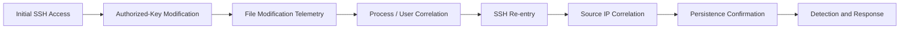

# CatchMe Linux SOC — Project 03
# SSH Authorized-Key Backdoor Threat Hunt

## Threat-Hunting Hypothesis

## Hypothesis

An attacker who gains access to the `socadmin` account may establish persistent SSH access by adding an unauthorized public key to `/home/socadmin/.ssh/authorized_keys`. The persistence activity should produce a combination of file modification, authentication, process, account, and network telemetry that can be correlated in Elastic SIEM.

## Why This Hypothesis Matters

An SSH key can provide persistent access without requiring repeated password authentication. Therefore, an investigation focused only on failed or successful password authentication may miss the persistence mechanism.

The hunt must correlate:

1. SSH authentication activity.
2. Changes to `authorized_keys`.
3. The process responsible for the modification.
4. The account performing the modification.
5. The source IP associated with subsequent SSH access.
6. The timing relationship between key modification and re-entry.
7. Any related privilege or post-compromise activity.

## Initial Triage Questions

### Account

- Which account was involved?
- Was the account expected to modify its SSH configuration?
- Was the account already active before the modification?

### File

- Was `/home/socadmin/.ssh/authorized_keys` modified?
- When did the modification occur?
- Which process changed the file?
- Which user performed the change?
- Did the file size or entry count change?

### Authentication

- Was SSH authentication observed immediately before or after the file change?
- Did the newly introduced key result in successful SSH authentication?
- What source IP was used?
- Was the source IP expected for the lab scenario?

### Process

- Which shell or utility performed the key modification?
- What parent process initiated it?
- Are there unusual command-line arguments?

### Network

- Did the target receive an SSH connection from the controlled attacker?
- Did the source IP correspond to `192.168.1.10`?
- Were there additional network connections during the scenario?

## Expected Investigation Chain



## Hunt Data Requirements

The investigation should attempt to obtain:

- SSH authentication events.
- File modification events.
- Process execution telemetry.
- User/account context.
- Source and destination IP information.
- Timestamps in IST and original event time where available.
- Auditd records where available.
- Elastic Agent endpoint telemetry.
- Relevant Kibana/Elastic Security events.

## Expected Suspicious Pattern

A high-confidence persistence sequence would be:

```text
Account access
      ↓
authorized_keys modification
      ↓
new SSH public key present
      ↓
SSH connection using the new key
      ↓
same source IP / related session
      ↓
persistence confirmed
```

This is an investigation hypothesis. Actual findings must be based only on telemetry collected during the controlled scenario.

## False-Positive Considerations

Legitimate SSH key modifications can occur during:

- administrator account provisioning,
- authorized maintenance,
- configuration management,
- key rotation,
- incident-response activity,
- approved automation.

Therefore, an `authorized_keys` modification alone should not automatically be treated as malicious. The investigation must consider user, source IP, process, timing, authorization, and subsequent authentication behavior.

## Hunt Success Criteria

The hypothesis is supported only if collected evidence demonstrates a meaningful relationship between:

- the key-file modification,
- the responsible account/process,
- subsequent SSH authentication,
- and the controlled attacker source.

No result should be considered confirmed until supported by actual endpoint or SIEM telemetry.
