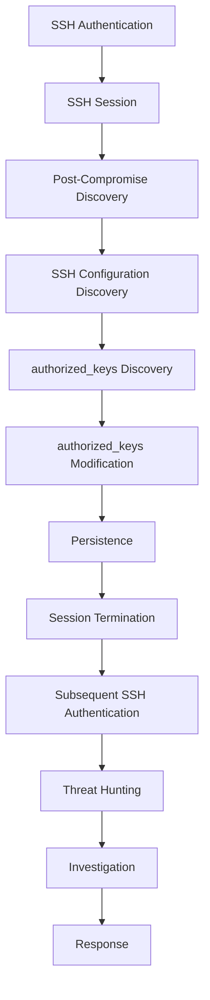

# Threat-Hunting Hypothesis

## Project

Project 03 — SSH Authorized-Key Backdoor

## Primary Hypothesis

A valid SSH session to `soc-linux` may be followed by suspicious discovery of SSH configuration and modification of the user's `authorized_keys` file, resulting in persistence and subsequent SSH re-entry.

## Investigation Question

Can the SOC detect and correlate SSH access, post-compromise discovery, `authorized_keys` modification, persistence establishment, and subsequent SSH re-entry on the Linux endpoint?

## Supporting Hypotheses

### Hypothesis 1 — SSH Access

A valid SSH session may establish an interactive shell on `soc-linux`.

### Hypothesis 2 — Post-Compromise Discovery

The authenticated user may perform host, account, SSH, or file-system discovery shortly after login.

### Hypothesis 3 — Persistence

The authenticated session may access and modify `authorized_keys`.

### Hypothesis 4 — Persistence Reuse

A subsequent SSH authentication may occur after the key modification and may be associated with the persistence mechanism.

### Hypothesis 5 — Process Correlation

The file modification may be correlated with a shell or process responsible for the persistence action.

## Initial Investigation Questions

| Area | Question |
|---|---|
| Identity | Which account authenticated? |
| Source | What IP initiated the SSH connection? |
| Authentication | What authentication method was used? |
| Session | When was the SSH session created and terminated? |
| Behavior | What activity occurred after authentication? |
| Discovery | Was SSH configuration or `authorized_keys` inspected? |
| File | Was `authorized_keys` modified? |
| Process | Which process performed the modification? |
| Persistence | Was an unauthorized key established? |
| Re-entry | Was the persistence mechanism subsequently used? |
| Scope | Which host and account were affected? |
| Response | What containment and remediation actions are required? |

## Expected Investigation Flow



## Investigation Pivots

```text
Source IP
    ↓
User
    ↓
SSH Authentication
    ↓
Session
    ↓
Process
    ↓
Command / Shell
    ↓
authorized_keys
    ↓
Modification
    ↓
Persistence
    ↓
Subsequent Authentication
```

## Evidence Requirement

Each confirmed stage must be supported by actual endpoint telemetry, Elastic telemetry, logs, query results, screenshots, or other collected evidence.

## Outcome Classification

| Outcome | Meaning |
|---|---|
| Confirmed | Evidence supports the hypothesis |
| Partially Confirmed | Some stages are supported |
| Not Confirmed | Available evidence does not support the hypothesis |
| Not Observable | Required telemetry was unavailable |

## Constraint

This hypothesis applies only to the controlled CatchMe Linux SOC laboratory.

Lab systems:

- Kali `192.168.1.10`
- `soc-linux` `192.168.1.16`
- `elastic-siem` `192.168.1.11`
