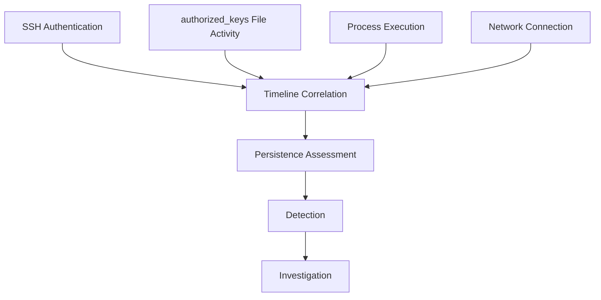

# CatchMe Linux SOC — Project 03
# SSH Authorized-Key Backdoor Threat Hunt

## Telemetry Requirements

## Purpose

Define the telemetry required to investigate SSH authorized-key persistence before attack execution.

## Required Telemetry Sources

| Telemetry Source | Purpose | Required Investigation |
|---|---|---|
| SSH authentication logs | Identify SSH access | Successful/failed authentication |
| Auditd | File/process/account activity | `authorized_keys` modification and execution context |
| Elastic Agent | Endpoint collection | Process, file, host and security telemetry |
| Elastic Security / Kibana | Central correlation | Search, detection and timeline analysis |
| Network telemetry | Source/destination context | SSH source IP and connection timing |
| Shell/process telemetry | Command execution context | Identify modification process where available |

## Critical Artifact

Primary persistence artifact:

```text
/home/socadmin/.ssh/authorized_keys
```

The pre-attack baseline contains one legitimate `ssh-ed25519` entry.

## Expected Telemetry Categories

### 1. Authentication

Look for:

- SSH login attempts.
- Successful SSH authentication.
- Failed SSH authentication.
- Authentication method.
- Username.
- Source IP.
- Source port.
- Session start/end.
- SSH process identity.

### 2. File Activity

Look for:

- Modification of `authorized_keys`.
- File creation/deletion if applicable.
- File size changes.
- Ownership changes.
- Permission changes.
- Timestamp changes.
- Related `.ssh` directory activity.

### 3. Process Activity

Look for:

- `sshd`.
- Shell processes.
- File-editing or key-management utilities.
- Parent/child process relationships.
- Command-line arguments where available.
- User context.

### 4. Account Activity

Look for:

- `socadmin` activity.
- UID/GID context.
- Privilege use.
- Session creation.
- Session termination.

### 5. Network Activity

Look for:

- Source IP `192.168.1.10`.
- Destination `192.168.1.16`.
- TCP/22 activity.
- Connection timing relative to key modification.
- Any unexpected additional network activity.

## Baseline Telemetry State

Verified before attack:

```text
Auditd:
enabled 1
lost 0

Elastic Agent:
HEALTHY / Running

Fleet:
HEALTHY / Connected

SSH:
active
TCP/22 listening
```

## Telemetry Correlation Model



## Minimum Evidence Requirements

The attack should not be considered investigation-complete unless sufficient telemetry is available to establish, where supported:

1. The baseline state of `authorized_keys`.
2. The time of the persistence modification.
3. The account responsible.
4. The process responsible, if collected.
5. The resulting key state.
6. Subsequent SSH authentication behavior.
7. Source IP correlation.
8. Relevant Elastic Security events.
9. Evidence supporting the final investigation conclusion.

## Telemetry Validation Commands

On `soc-linux`:

```bash
systemctl is-active auditd
systemctl is-enabled auditd
sudo auditctl -s | grep -E 'enabled|lost'
systemctl is-active elastic-agent
sudo elastic-agent status
ss -lntp | grep ':22'
```

For SSH configuration context:

```bash
sudo sshd -T | grep -E '^(permitrootlogin|pubkeyauthentication|passwordauthentication|x11forwarding|permituserenvironment|maxauthtries|logingracetime)'
```

For authorized-key baseline:

```bash
sudo stat ~/.ssh/authorized_keys 2>/dev/null || true
sudo sed -n '1,20p' ~/.ssh/authorized_keys 2>/dev/null || true
```

## Telemetry Gaps

If a required telemetry source is unavailable during execution:

- record the gap,
- do not fabricate the missing event,
- use alternative available evidence only when appropriate,
- document the limitation in the investigation findings.

## Telemetry Success Criteria

Telemetry is considered ready when:

- Auditd is enabled.
- Auditd reports `lost 0`.
- Elastic Agent is healthy.
- Fleet is connected.
- SSH is active.
- TCP/22 is listening.
- The baseline `authorized_keys` state is documented.
- The investigation can correlate file, process, authentication, account, and network activity where those data sources are available.
